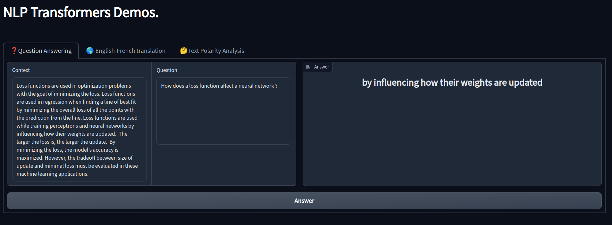
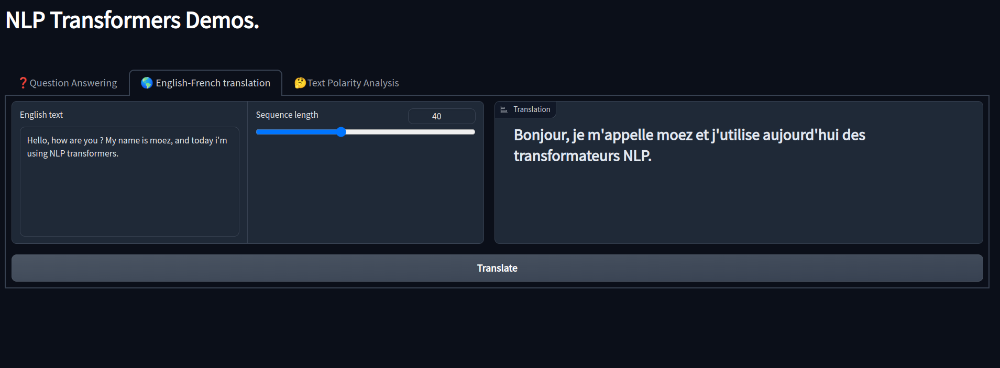
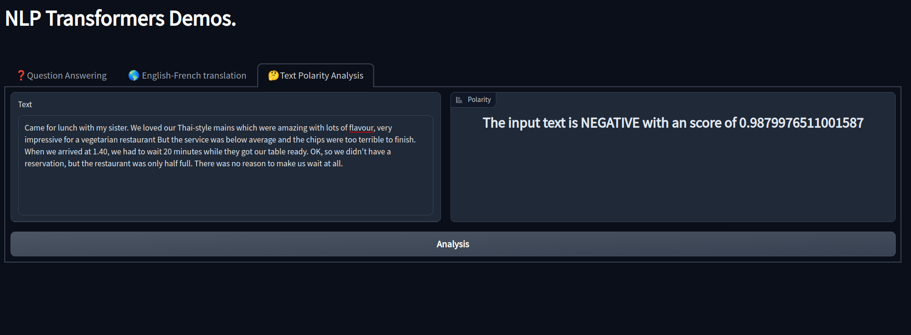

# 📜 Huggingface Transformers Demo
Demo of different huggingface NLP transformers pipelines : 

* Question Answering.
* Text Translation.
* Text Polarity Analysis.

## Question Answering


## Text Translation


## Text Polarity Analysis


# Usage
Installing necessary requirements :
```
python install -r requirements.txt
```
Running the application :
```
python app.py
```
**Note :** The first time that app is started is going to take some time since the pre-trained models will be downloaded.

# Models
1. **Question Answering** : The default model in use is the [distilbert-base-cased-distilled-squad](https://huggingface.co/distilbert-base-cased-distilled-squad).
It also uses the same [distilbert-base-cased-distilled-squad](https://huggingface.co/distilbert-base-cased-distilled-squad) tokenizer.

2. **Translation** : Performs English to French text translation, which can be changed, to any pre-trained language pair available. Example :
```
translator = pipeline("translation_en_to_fr")
# Or
translator = pipeline("translation_en_to_de")
```
**Note** Prediction with sequence length variation can be explored woth the sequence length slide (default=40).

3. **Text Polarity Classification** : Analyses the input to text to determine if it's a 'POSTITIVE' or 'NEGATIVE' text contxt, and returns the score.
